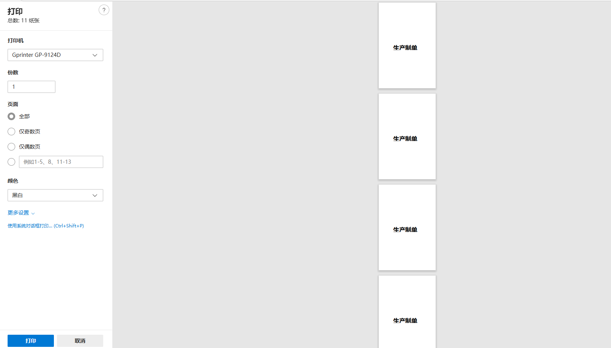

# 服装生产ERP管理系统

一个功能完整的服装生产ERP管理系统，实现从订单到财务的全流程数字化管理，支持扎号追溯、扫码报工、成本核算、外协加工等核心功能。



## 功能模块

### 首页看板
- **首页概览** - 订单统计、生产进度、库存预警等关键指标展示
- **生产看板** - 实时展示订单进度、裁床产量、车间产量
- **预警中心** - 库存预警、交期预警、异常提醒
- **全流程追溯** - 通过扎号追溯从裁床到入库的完整流程

### 销售管理
- **订单管理** - 订单录入、审核、生产下达、进度跟踪
- **打样管理** - 样品开发、打样申请、样衣管理
- **款号管理** - 款号档案、款式图片、工艺要求

### 生产管理
- **生产排程** - 甘特图可视化排程，按交期自动排产
- **BOM管理** - 物料清单管理，面料/辅料/印绣花/包装清单
- **工艺路线** - 工序流程定义，车间报工按路线执行
- **工序管理** - 工序定义、计件单价、工序分组
- **尺码规格** - 尺码规格表模板管理
- **裁床管理** - 裁床任务创建、床次管理、扎号生成与移交
- **车间报工** - 扫码报工、进度跟踪、计件工资核算
- **尾部管理** - 整烫、查衫、包装、入库管理

### 品质管理
- **IQC检验** - 来料检验
- **IPQC检验** - 过程检验
- **FQC检验** - 最终检验
- **OQC检验** - 出货检验

### 物料管理
- **面料库存** - 面料入库、出库、盘点
- **辅料库存** - 辅料库存管理
- **成品库存** - 成品入库、发货管理
- **客供料管理** - 客户提供物料管理
- **委外仓储** - 外协物料库存

### 外协管理
- **印花外协** - 印花加工订单与跟踪
- **绣花外协** - 绣花加工订单与跟踪
- **洗水外协** - 洗水加工订单与跟踪
- **缝制外协** - 外发加工订单与跟踪
- **整烫外协** - 整烫加工订单与跟踪

### 财务管理
- **应收账款** - 客户对账、收款管理
- **应付账款** - 供应商对账、付款管理
- **成本核算** - 订单成本、加工成本核算
- **计件工资** - 员工计件工资结算

### 基础资料
- **客户管理** - 客户档案、信用管理
- **供应商管理** - 供应商档案、采购管理
- **员工管理** - 员工档案、技能等级
- **班组管理** - 生产班组、人员配置

### 系统管理
- **用户管理** - 用户账号、权限分配
- **角色管理** - 角色定义、权限配置
- **系统设置** - 系统参数配置
- **操作日志** - 操作记录追溯

## 核心功能特性

### 1. 扎号追溯系统
每个裁床任务生成唯一扎号，实现从裁床→缝制→尾部→入库的全流程追溯：
- 扫码查看当前工序、已完成工序
- 实时更新扎号位置和状态
- 支持不良品追溯和责任定位

### 2. 订单-BOM强联动
选择订单后自动带出所有基础信息：
- 款号、品名、客户信息自动填充
- 工艺要求（印花、洗水、包装）自动关联
- 裁床创建任务时从订单选择，数据自动关联

### 3. 工艺路线管控
车间报工必须按工艺路线执行：
- 禁止跳工序报工
- 自动记录完成工序
- 支持工序返工处理

### 4. 计件工资自动核算
- 工序单价设置
- 报工数量自动计算工资
- 支持保底工资、补贴
- 月度工资汇总结算

### 5. 外协加工管理
支持5种外协类型：
- 印花、绣花、洗水、缝制、整烫
- 自动生成外协应付单
- 跟踪外协进度和质量

## 技术栈

- **框架**: Next.js 16 (App Router)
- **核心**: React 19
- **语言**: TypeScript 5
- **UI组件**: shadcn/ui (基于 Radix UI)
- **样式**: Tailwind CSS 4
- **图标**: Lucide React
- **包管理器**: pnpm 9+
- **数据存储**: localStorage（模拟数据库）

## 快速开始

### 环境要求
- Node.js 18+
- pnpm 9+

### 安装依赖

```bash
pnpm install
```

### 启动开发服务器

```bash
coze dev
```

启动后，在浏览器中打开 [http://localhost:5000](http://localhost:5000) 查看应用。

### 构建生产版本

```bash
coze build
```

### 启动生产服务器

```bash
coze start
```

## 项目结构

```
src/
├── app/                          # Next.js App Router 路由
│   ├── dashboard/               # 主系统页面
│   │   ├── orders/             # 订单管理
│   │   ├── bom/                # BOM管理
│   │   ├── cutting/            # 裁床管理
│   │   ├── workshop/           # 车间报工
│   │   ├── tail/               # 尾部管理
│   │   ├── quality/            # 品质管理
│   │   ├── stock/              # 库存管理
│   │   ├── outsource/          # 外协管理
│   │   ├── finance/            # 财务管理
│   │   └── ...                 # 其他模块
│   ├── login/                   # 登录页面
│   └── layout.tsx               # 根布局
├── components/                   # React组件
│   ├── ui/                      # shadcn/ui基础组件
│   └── layout/                  # 布局组件
├── types/                        # TypeScript类型定义
│   ├── order.ts                 # 订单相关类型
│   ├── bom.ts                   # BOM相关类型
│   ├── cutting.ts               # 裁床相关类型
│   ├── workshop.ts              # 车间报工类型
│   └── ...                      # 其他类型
├── data/                         # 演示数据
│   └── demo-data.ts             # 完整演示数据初始化
├── hooks/                        # 自定义Hooks
│   └── useInitDemoData.ts       # 演示数据初始化Hook
└── lib/                          # 工具函数
    └── utils.ts                 # 通用工具函数
```

## 数据流程

```
客户资料 → 订单录入 → BOM制定 → 生产排程
    ↓          ↓          ↓          ↓
供应商   →   采购   →   裁床任务   → 扎号生成
                                        ↓
外协加工 ← 印绣花/洗水 ← 车间报工 ← 扎号分发
                                        ↓
                              尾部管理 → 入库 → 发货
                                        ↓
                              财务核算 → 成本分析
```

## 演示数据

系统内置完整演示数据，首次访问时自动初始化：

- **客户数据**: 优衣库、ZARA、H&M
- **供应商数据**: 面料、辅料、外协供应商
- **订单数据**: 完整订单含工艺要求、包装要求
- **BOM数据**: 面料、辅料、印花、包装清单
- **生产数据**: 裁床任务、扎号记录、报工记录
- **库存数据**: 面料、辅料库存

重置演示数据：
```javascript
// 在浏览器控制台执行
localStorage.removeItem('erp_demo_initialized')
// 刷新页面
```

## 开发规范

### 组件开发
- 优先使用 `src/components/ui/` 中的 shadcn/ui 组件
- 使用 TypeScript 严格模式
- 遵循函数式组件开发规范

### 样式开发
- 使用 Tailwind CSS 类名
- 使用主题变量 (`--primary`, `--background` 等)
- 支持亮色/暗色主题切换

### 数据管理
- 使用 localStorage 模拟后端数据库
- 数据类型定义在 `src/types/` 目录
- 遵循单向数据流原则

## 登录信息

- 用户名: `admin`
- 密码: `admin123`

## 参考文档

- [Next.js 官方文档](https://nextjs.org/docs)
- [shadcn/ui 组件文档](https://ui.shadcn.com)
- [Tailwind CSS 文档](https://tailwindcss.com/docs)

## License

MIT
